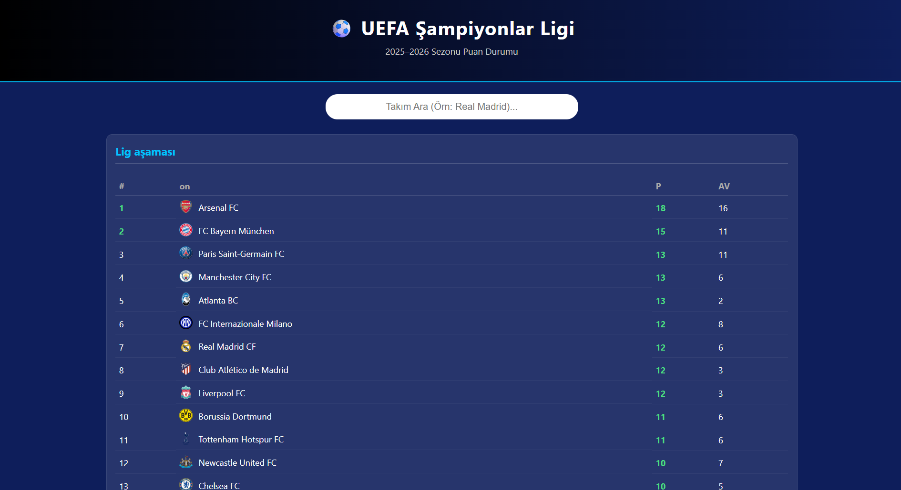

# UEFA Şampiyonlar Ligi Puan Durumu - React Final Ödevi

**Hacettepe Üniversitesi Eğitim Fakültesi BÖTE Bölümü** **Ders:** WEB Programcılığı – React API Final Ödevi  
**Dersi Veren:** Dr. Esra KIDIMAN DEMİRHAN  
**Hazırlayan:** ELİFNUR BAĞCI
---

## 📝 Konu ve Amaç
**Konu:** React ile API kullanarak dinamik bir web sayfası geliştirme.  
**Amaç:** Bu proje; React bileşen yapısını (Component), `fetch` metodunu, `useState` ve `useEffect` hook'larını kullanarak canlı veriyi çekmeyi ve kullanıcıya anlamlı bir şekilde sunmayı amaçlar.

Projede **Football-Data.org** API servisi kullanılarak 2025-2026 sezonu UEFA Şampiyonlar Ligi puan durumu ve takım istatistikleri listelenmektedir.


## 🔗 Kullanılan API
Projede veriler aşağıdaki açık kaynak API'den sağlanmaktadır:
* **API Adı:** Football-Data.org
* **API Linki:** [https://www.football-data.org/](https://www.football-data.org/)

## 🛠️ Projenin Çalıştırılması
Bu projeyi bilgisayarınızda çalıştırmak için terminalde sırasıyla şu komutları uygulayın:

1.  **Projeyi indirin:**
    ```bash
    git clone [https://github.com/elofnorx/uefa-sampiyonlar-ligi.git](https://github.com/elofnorx/uefa-sampiyonlar-ligi.git)
    ```

2.  **Proje klasörüne girin:**
    ```bash
    cd uefa-sampiyonlar-ligi
    ```

3.  **Gerekli kütüphaneleri yükleyin:**
    ```bash
    npm install
    ```

4.  **Uygulamayı başlatın:**
    ```bash
    npm start
    ```
    Tarayıcınızda `http://localhost:3000` adresinde proje açılacaktır.

## 📸 Ekran Görüntüsü

